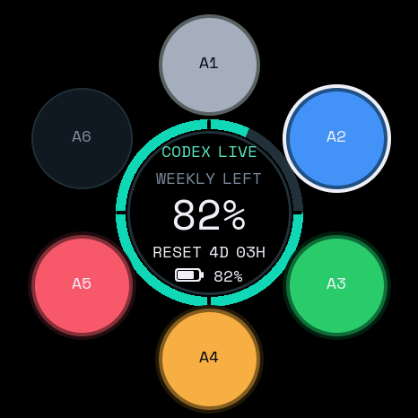

# Codex Micro for Waveshare ESP32-S3-Touch-AMOLED-1.75C(Windows)

[English](README.md)

把 **Waveshare ESP32-S3-Touch-AMOLED-1.75C**(1.75 英寸 466×466 AMOLED 触摸屏开发板)
变成 ChatGPT Codex Micro 的无线控制台和用量仪表盘。本项目是
[codex-micro-stopwatch](https://github.com/digitsisyph/codex-micro-stopwatch)
(M5Stack StopWatch C152) 的社区移植——**首个 Waveshare/Windows 版本**。

> 非官方移植,与 OpenAI / Work Louder / M5Stack / Waveshare 均无官方关系。



## 功能

- 6 个智能体圆点:实时状态(空闲/思考/完成/等待输入/错误),点击聚焦
- 中心圆盘 = **发送**,并显示 Codex 用量百分比与重置倒计时
- **BOOT 键**按住 = 对讲(Push to talk,`ACT10`)
- **PWR 键**短按 = 语音聊天开关(`ACT09`)
- 四向滑动 = Codex Micro 模拟摇杆(上下左右)
- 电池、充电/Dock 状态、连接健康(CODEX LIVE / BLE ONLY / OFFLINE)
- 智能体完成时柔和提示音 + 震动反馈
- 桌面待机息屏、长按中心 6 秒关机

## 硬件需求

- Waveshare ESP32-S3-Touch-AMOLED-1.75C
- Windows 10/11(支持 BLE;**强烈建议**把 Intel 蓝牙驱动升级到 24.x,老驱动易断连)
- ChatGPT 桌面端(Codex 版本)并已登录
- USB-C 数据线(仅首次烧录 / 充电,日常无线)

## 推荐安装方式:让 Codex 来做

这是首选安装路径。把这个仓库的文件夹在 Codex 桌面端中打开,粘贴下面的提示词
——Codex 会读取 [README.md](README.md) 和 [AGENTS.md](AGENTS.md),自动完成
构建、烧录、验证。

### 1. 在本地打开仓库

下载 ZIP 或 clone 本仓库,然后在 Codex 桌面端中打开该文件夹。仓库放在将要
配对手表的这台 Windows 电脑上。

### 2. 连接手表

用数据线连接 Waveshare 1.75C。如果还插着其他开发板,不要猜测 COM 口。

### 3. 把这段粘贴给 Codex

```text
Install this project on my physical Waveshare ESP32-S3-Touch-AMOLED-1.75C.

Read AGENTS.md and README.md completely before acting. Work through the setup
autonomously, but follow these safety rules:

1. Start with read-only checks. Confirm Windows, the Waveshare 1.75C target,
   available build tools, and the exact newly connected COM port.
2. Explain any missing dependency before installing it. Never ask me for an
   OpenAI API key, login cookie, access token, or other credential.
3. Build the firmware (`pio run -e m5stack-stopwatch`, or
   `-c platformio.win.ini` on Windows) before attempting an upload.
4. Immediately before flashing, report the exact COM port you resolved and
   ask me to confirm that one destructive device action.
5. After flashing, verify the CODEX_MICRO_STOPWATCH_READY marker with
   `python scripts/serial_probe_win.py <the exact port> --seconds 30
   --expect CODEX_MICRO_STOPWATCH_READY`, then guide me through Windows
   Bluetooth pairing ("Codex Micro").
6. If controls do nothing after pairing, tell me to forget the device and
   pair again (Windows does not always re-subscribe HID notifications; the
   firmware forces the local CCCD, and a fresh pairing always fixes it).
7. Help me configure ChatGPT Desktop: BOOT = Push to talk, PWR = Toggle
   voice chat, center = Send, and let me choose the four swipe actions.
8. Quota sync is optional. If I approve, run
   `companion-win/setup_win_companion.ps1` in my own PowerShell and keep any
   generated paths, tokens, and logs out of Git.
9. Verify buttons, center Send, four swipes, Agent colors, completion chime,
   haptics, and a real quota/reset update separately. Report anything that
   was not physically observed as unverified.
```

仓库里的 [AGENTS.md](AGENTS.md) 给了 Codex 持久化的安装与隐私边界,提示词可以
保持简短。Claude Code 等其他本地编码代理也可以照此执行。

### 4. 完成 Windows 上的可见步骤

Codex 会处理终端工作,但以下步骤仍需你手动确认:

1. 批准安装缺失的构建工具。
2. 烧录前确认准确的 COM 口。
3. 在 **设置 > 蓝牙和其他设备** 中配对 **Codex Micro**。
4. 如需用量同步,在**你自己的 PowerShell** 里运行
   `companion-win\setup_win_companion.ps1`(需要你的 Codex 登录态)。
5. 在 **ChatGPT 桌面端 > 设置 > Codex Micro** 里配置按键。

## 手动构建与烧录

推荐使用上面的 Codex 辅助流程。也可以手动用
[PlatformIO Core](https://docs.platformio.org/en/latest/core/index.html) 构建:

```sh
pio run -e m5stack-stopwatch
pio run -e m5stack-stopwatch -t upload --upload-port COM5
```

或使用一键烧录脚本(自动查找 esptool,无需 PlatformIO):

```powershell
powershell -ExecutionPolicy Bypass -File flash_codex.ps1 -Port COM5
```

启动成功会输出:

```text
CODEX_MICRO_STOPWATCH_READY
```

用同一串口验证该标记:

```sh
python scripts/serial_probe_win.py COM5 --seconds 30 --expect CODEX_MICRO_STOPWATCH_READY
```

## 按键说明

| 表上操作 | 报告按键 | 建议配置 |
| --- | --- | --- |
| 按住 BOOT | `ACT10` | Push to talk |
| 短按 PWR | `ACT09` | Toggle voice chat |
| 点中心圆盘 | `ACT12` | Send |
| 上/右/下/左滑动 | 模拟摇杆方向 | 自定义 |
| 长按中心 6 秒 | 旅行关机(带提示) | 电源键或 USB 唤醒 |

## 用量 companion 与隐私

Codex Micro HID 接口不含账户限额。Windows companion(`companion-win/`)读取本机
Codex 的 `auth.json` access token(`CODEX_HOME` 或 `~/.codex`),直接调用用量接口,
只把手表明确绑定的这两个数字经 BLE 写入手表:

- 剩余百分比;
- 重置倒计时;

它不会向手表发送 API key、access token、账户标识、提示词、任务文本或音频。
本地路径、令牌和日志绝不提交。移植细节见 [docs/PORTING_WAVESHARE.md](docs/PORTING_WAVESHARE.md)。

## 与上游 C152 的差异

| 项目 | 上游 C152 | 本移植(Waveshare 1.75C) |
| --- | --- | --- |
| 侧键 | 左右物理键 | BOOT(对讲)/ PWR(语音聊天) |
| 触摸 | 465×465 全分辨率 | CST9217 0~232 镜像坐标,固件镜像+缩放 |
| 电源 | M5PM1 | AXP2101(GPIO14/15 I2C) |
| 音频 | M5PM1 驱动 | ES8311(手动 I2S 配置) |
| 蓝牙主机 | macOS (HOGP) | Windows(hidbthle,强制 CCCD 订阅) |
| 配额同步 | Swift companion | Windows Python(bleak)companion |

## 常见问题

### 点一下智能体窗口弹好几次 / 智能体一直闪烁

CST9217 一次物理点击可能产生多个 press/release 周期。固件在每次提交后做
**600ms 同位置锁定**:同一点的重复周期被吞掉,点其他位置(另一个智能体、中心
发送)立即放行。

### 中心圆盘没反应

中心 = 发送键。若刚点过智能体,600ms 同位置锁定可能吞掉中心点击(防 ghost),
稍等片刻再点即可。

### 蓝牙一直断连

- 把 Intel 蓝牙驱动升级到 24.x
- 删除设备重新配对一次
- 确认没有第二个 "Codex Micro" 设备占用

### 配对后有反应,手表重连后失灵

Windows 重连时不一定重新订阅 HID 通知。删除配对重新配一次即可——固件已强制
本地 CCCD,新配对一定能恢复输入。

## License / 致谢

MIT License。移植自 [digitsisyph/codex-micro-stopwatch](https://github.com/digitsisyph/codex-micro-stopwatch)
与 [imliubo/codex-micro-4-core2](https://github.com/imliubo/codex-micro-4-core2),
署名见 [LICENSE](LICENSE) 与 [NOTICE.md](NOTICE.md)。Space Mono 字体遵循
SIL Open Font License 1.1。
